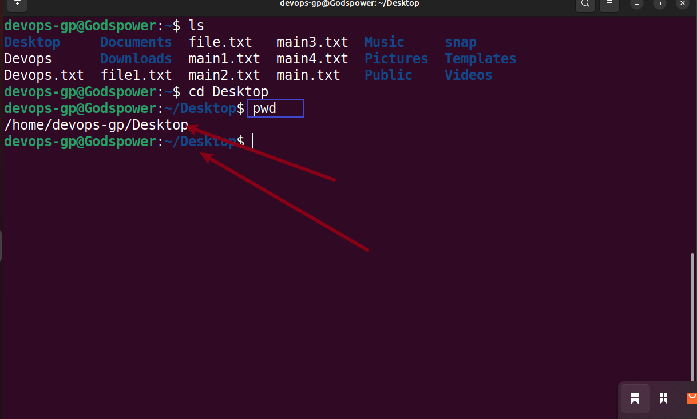
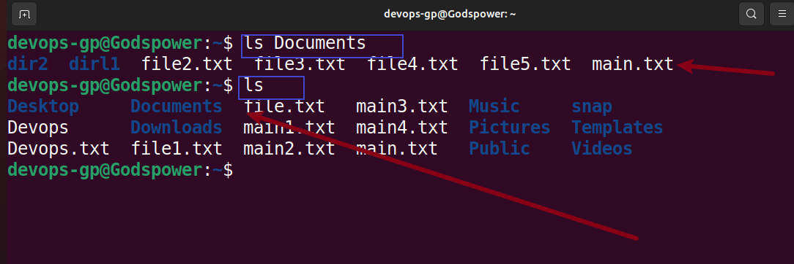
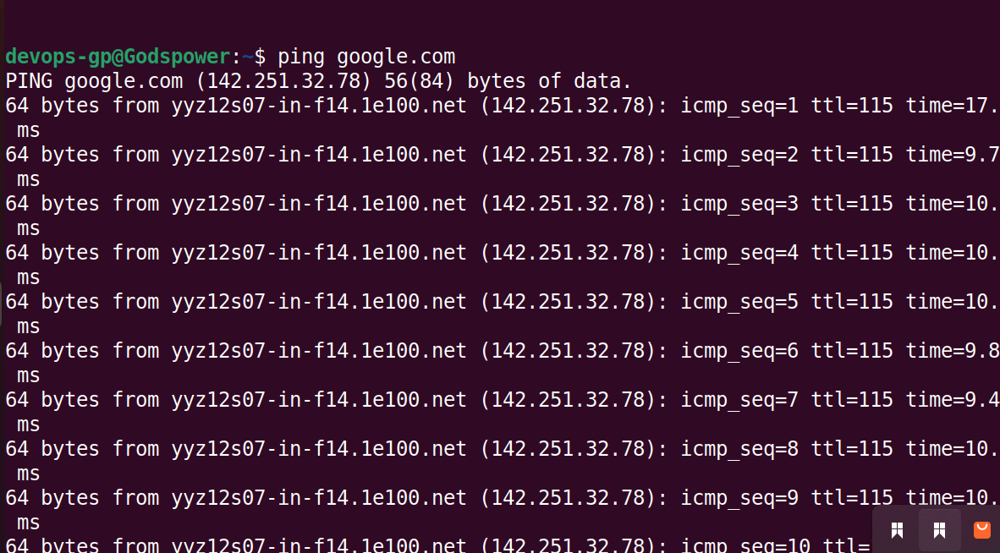

# Linux-Project Implementation
In this project, i will be implementing some basic linux commands.

## Sudo Command
This command is also known as super user do. This command allows you to run programs with the security privileges of another user. It prompt you for your personal password and confirms your request to execute a command by checking a file called sudoers, which the system administrator configured.

To use the sudo command, we use the following synthax `sudo apt upgrade`

## PWD Command
This command is use to show the present working directory

The synthax for this command is `pwd`

## cd command
The cd command in Linux stands for change directory. It is used to change the current directory of the terminal.

The synthax for this command is ` cd + directory
`

## Ls Command

The ls command writes to standard output the contents of each specified Directory or the name of each specified File, along with any other information you ask for with the flags

The synthax for ls command is `ls`

## cat command

Concatenate of cat command is one of the most commonly used linux command, it read, combines and write file contents to the standard output

To use the cat command, `type cat followed by the file name and it extension`

## cp command

This command is use to copy file and directories in linux

To use this command we use `cp options, source destination`

## mv command

mv Command is use to move and rename files and directories. It does not produce an output upon execution

To use this command simply type `mv followed by the file name and the destination directory

## mkdir

This command is use to create one or multiple directories at once and set permission for each of them.

The synthax is `mkdir option directory name`

## rmdir command

This command is use to delete or remove and empty dirctory.

The synthax is `rmdir followed by the directory`

## rm command

This command is used to delect files within a directory.

The synthax is `rm directory name, to remove multiple folders you can add -r. r stands for recursive`

## Touch Command

The touch command allow you to create an empty files

The synthax for this command is `touch followed by the file name`

## Locate command

The locate command is used to find a file in the data base system, moreover, adding the -i argument will turn off case sensitivity so you can search for a file even if you do not remember it exact name.

The synthax is `locate -i + file name`

## find command

This command can be used to search for file with the directories and perform subsequent operation

The synthax is `find directory name and file name`

## The grep command

grep stands for global regular expression print. it let you find a word by searching through all the texts  in a specific file. once the grep command find a match, it prints all lines that conatains the specific pattern. This command helps filter through large files.

The synthax is `grep file name`

## df command

This command is use to report the system disc space usage shown in percentage and kilobites

The synthax is `df [option] file`

## du command

This command is use to check how much space a file or directory takes up. you can run this command to identify which part of the system uses the storage excessively.

The synthax is `du [directory path]
`

## The head command

This command allows you to view the first ten lines of a text. This command is also use to output piped data to the cli.

The synthax is `head [option] file`

## The tail command

This command dispalys the last ten lines of a file. It allows user to check whether a file has new data or to read error messages.

The synthax is `tail [option]file`

## The diff command

short for difference. This command is use to compare two content of a file line by line. after analysing them, it will display the part that do not match. Programmers often use the diff command to alter a program instead of re-writing the entire source code.

The synthax is `diff[option]file1 file2`

## tar command

The tar command archives multiple files into tar files. a common linux command similar to zip.

The synthax is `tar[option]archive_file file or directory to be archived`

## chmod command
This command modifiesa file or directory's read, write and execute permission. In linux, each file is associated with three user classes- owner, group members and others.

The synthax is `chmod [option] [permission] file_name`

## useradd command
Linux is a multi-user system. meaning more than one user can use it simultenously.useradd is use to create a new account, while the passwd is use to create password for the new account. only those with root privileges or sudo can run this command.

The synthax is `useradd [option] username`

## Hostname Command

Run the hostname command to know the system's hostname. It can be executed with or without an option.

Here is the general synthax `hostname [option]`

## The zip command

This command is use to compress file into zip files. it can automatically choose the best compression ratio.

The synthax is `zip [option] zipfile`

## Top Command
The top command is used for memory monitoring. It works only on Linux platform. The top command produces an ordered list of running processes selected by user-specified criteria, and updates it periodically. By default, ordering is by CPU usage, and it shows processes that consume maximum CPU.

## Kill Command

The kill command is use to terminate an unresponsive program manually.It will signal misbehaving application and instruct them to close their process. To kill a program, you must know it process identification number (PID).

The synthax is `kill signal_option pid`

## ps command
The process status or ps command produces a snapshot of all running process in your system. The static result are taken from the virtual files in the file system

## man command

This command provide a user manual of any command or utilities you can run in terminal including the name, description and option.

The synthax is `man command_name`

## uname command

This command will print detailed information about your linux system and hardware. This include the machine name, operating system and kernel.

 The synthax is `uname option`

 

 ## wget command

 This command line let you download files from the internet. it works in the background without hindering other running process

 The synthax for this command is `wget [option] url`

 

 ## ping command

 This command is one of the most used linux command for checking whether a network or server is reachable. In addition, it is use to troubleshoot various connectivity issues.

 here is the synthax `ping [option]host_name or ip_address`

 

 ## echo command

 This command is a built-in utility that dispalys a line of text or string using the standard output.

 Here is the synthax `echo [option][string]`

 

 ## octal command

 octal permission is a numerical representation of the file permission in linux.

 

 

 